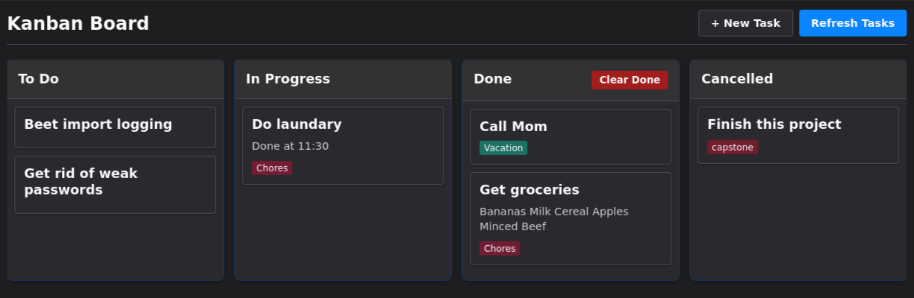

# Kanban Thunderbird

A Thunderbird Mail Extension that turns your tasks into a visual Kanban board.

Organize tasks by dragging them across columns — **To Do**, **In Progress**, **Done**, **Cancelled**. Status changes are persisted back to Thunderbird's built-in calendar via custom experiment APIs.



## Features

- Renders Thunderbird tasks as draggable Kanban cards
- Four columns: To Do, In Progress, Done, Cancelled
- Drag-and-drop to change task status
- Click any task to open Thunderbird's task editor
- "Create Task" button to add new tasks
- Auto-refresh on task create/update/delete (no manual reload needed)
- Overdue highlighting for past-due tasks
- Dark theme matching Thunderbird's UI

## Requirements

- **Thunderbird** 128.0 – 150.*
- No external dependencies, build tools, or package managers

## Installation

### Temporary (for development)

1. Open Thunderbird and go to `about:debugging`
2. Click **This Thunderbird**
3. Click **Load Temporary Add-on…**
4. Select `manifest.json` from this project

### Permanent (packed extension)

```bash
zip -r kanban-thunderbird.zip . -x "*.git*" "*.zip" "AGENTS.md"
```

Then install the `.zip` via Thunderbird's Add-ons Manager (gear menu → Install Add-on From File…).

## Project Structure

```
manifest.json            # Extension manifest with 6 experiment_apis
background.js            # Background script — message routing, task CRUD
kanban.html              # Main UI shell
kanban.js                # Frontend — board rendering, drag-and-drop
kanban.css               # Dark-theme stylesheet
icons/                   # Extension icons (16px, 32px SVG/PNG)
calendar/experiments/    # Thunderbird calendar experiment APIs
  calendar/
    ext-calendar-utils.sys.mjs   # Shared utilities (ES module)
    schema/                      # JSON API schemas
    parent/                      # Parent-process implementations
    child/                       # Child-process implementations
```

## Architecture

The extension has three layers:

1. **Frontend** (`kanban.js`) — renders the board in a tab, manages drag-and-drop, sends messages to the background script
2. **Background script** (`background.js`) — listens for messages from the frontend, proxies requests to calendar APIs, forwards real-time change events back to the frontend
3. **Experiment APIs** (`calendar/experiments/`) — six Thunderbird-specific APIs that bridge WebExtension code to Mozilla's internal calendar services (`calUtils`, `CalEvent`, `CalTodo`, etc.)

### Communication flow

```
Frontend (kanban.js)
  │  browser.runtime.sendMessage({ action: "getTasks" })
  ▼
Background (background.js)
  │  browser.calendar.items.query({ type: "task" })
  ▼
Experiment API (ext-calendar-items.js)
  │  cal.manager.getCalendars() → calendar.getItemsAsArray()
  ▼
Thunderbird's calendar storage
```

Calendar changes (create/update/delete) are pushed back in real time via `browser.calendar.items.onCreated/onUpdated/onRemoved` events.

## Development

### Quick reload

Changes to `kanban.js`, `kanban.css`, `kanban.html`, or `background.js` take effect after refreshing the Kanban tab (Ctrl+Shift+F5 or the **Refresh Tasks** button).

### Full restart required

Changes to files under `calendar/experiments/` require a Thunderbird restart — experiment APIs are loaded at startup and do not hot-reload.

### No build step

This is a plain vanilla WebExtension. No bundler, no transpiler, no `npm install`. Edit any file and reload.

## API Reference

The extension exposes the following custom browser APIs (via `manifest.json` `experiment_apis`):

| Namespace | Schema | Description |
|-----------|--------|-------------|
| `browser.calendar.calendars` | `calendar-calendars.json` | Query, create, update, remove calendars |
| `browser.calendar.items` | `calendar-items.json` | Query, create, update, move, remove tasks/events |
| `browser.calendar.provider` | `calendar-provider.json` | Register custom calendar providers |
| `browser.calendar.timezones` | `calendar-timezones.json` | Query timezone data |
| `browser.calendarItemAction` | `calendarItemAction.json` | Toolbar buttons in event dialogs |
| `browser.calendarItemDetails` | `calendarItemDetails.json` | Custom panels in event details view |

## License

GNU General Public License v3.0. See [LICENSE](LICENSE).
